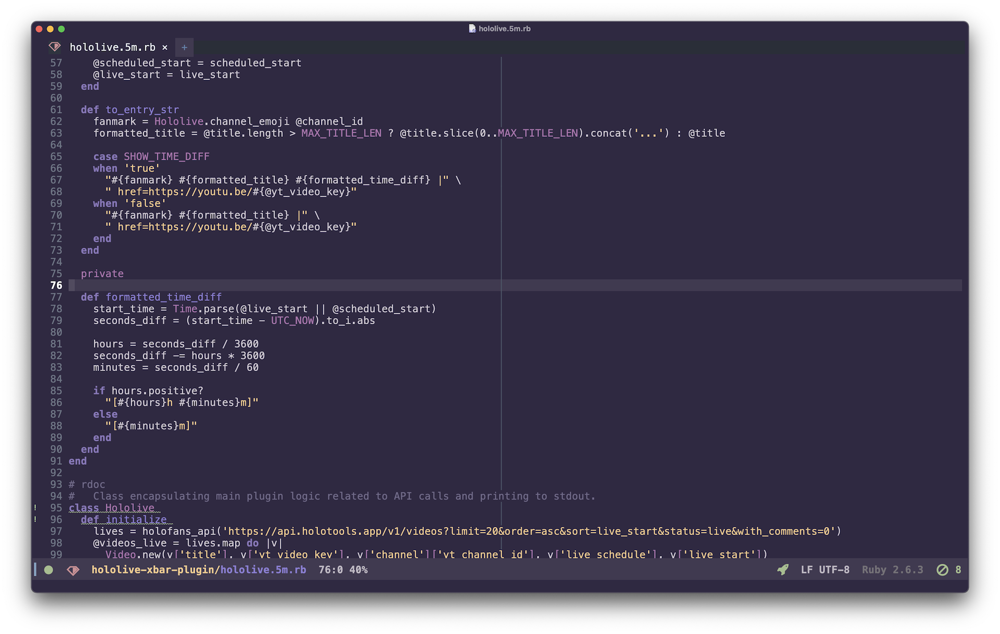
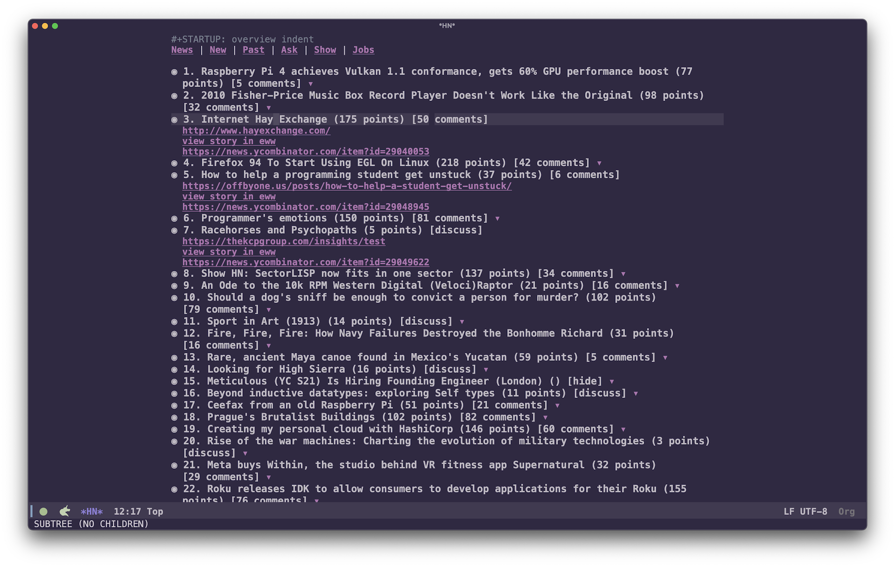

<h3 align="center">Ancient One Dark Emacs Theme</h3>
<hr/>

<p align="center">
  
</p>

<p align="center">
<a href="https://melpa.org/#/ancient-one-dark-theme"></a>
<a href="https://github.com/ianpan870102/wilmersdorf-emacs-theme"></a>
<a href="https://www.gnu.org/licenses/gpl-3.0"></a>
</p>

<p align="center">An Emacs theme with an ancient, mysterious vibe.</p>
<p align="center">神秘的なEmacsテーマ。</p>

<p align="center">Inspired by the original <a href="https://marketplace.visualstudio.com/items?itemName=uetchy.ancient-one-dark">Ancient One Dark theme</a>.</p>

<br/>
<br/>

## About　テーマについて

A color theme for Emacs based off uetchy's Ancient One Dark theme for VSCode, using a color palette similar to Ninomae Ina'nis from Hololive English.

一伊那尓栖/にのまえいなにすちゃんの色のテーマ。

## Screenshots スクリーンショット





## Installation インストール

The easiet way is to install from MELPA:

```
M-x package-install ancient-one-dark-theme
```

Then add this to your `init.el`

```emacs-lisp
(load-theme 'ancient-one-dark t)
```

## Contributing

### Reporting issues

Found a design glitch? Have ideas to improve the theme? Please [open an issue](https://github.com/holodata/ancient-one-dark-emacs/issues) on GitHub, or join `#ancient-one-dark` channel on [holodata Discord](https://holodata.org/discord).

Make sure to include a screenshot of the issue, and also run `describe-mode` and try to specify which face looks wrong.

### Contributors ✨

Thanks goes to these wonderful people ([emoji key](https://allcontributors.org/docs/en/emoji-key)):

<!-- ALL-CONTRIBUTORS-LIST:START - Do not remove or modify this section -->
<!-- prettier-ignore-start -->
<!-- markdownlint-disable -->
<table>
  <tr>
    <td align="center"><a href="https://github.com/DaniruKun"><br /><sub><b>Daniils Petrovs</b></sub></a><br /><a href="https://github.com/holodata/ancient-one-dark-emacs/commits?author=DaniruKun" title="Code">💻</a> <a href="#design-DaniruKun" title="Design">🎨</a></td>
  </tr>
</table>

<!-- markdownlint-restore -->
<!-- prettier-ignore-end -->

<!-- ALL-CONTRIBUTORS-LIST:END -->

This project follows the [all-contributors](https://github.com/all-contributors/all-contributors) specification. Contributions of any kind welcome!
